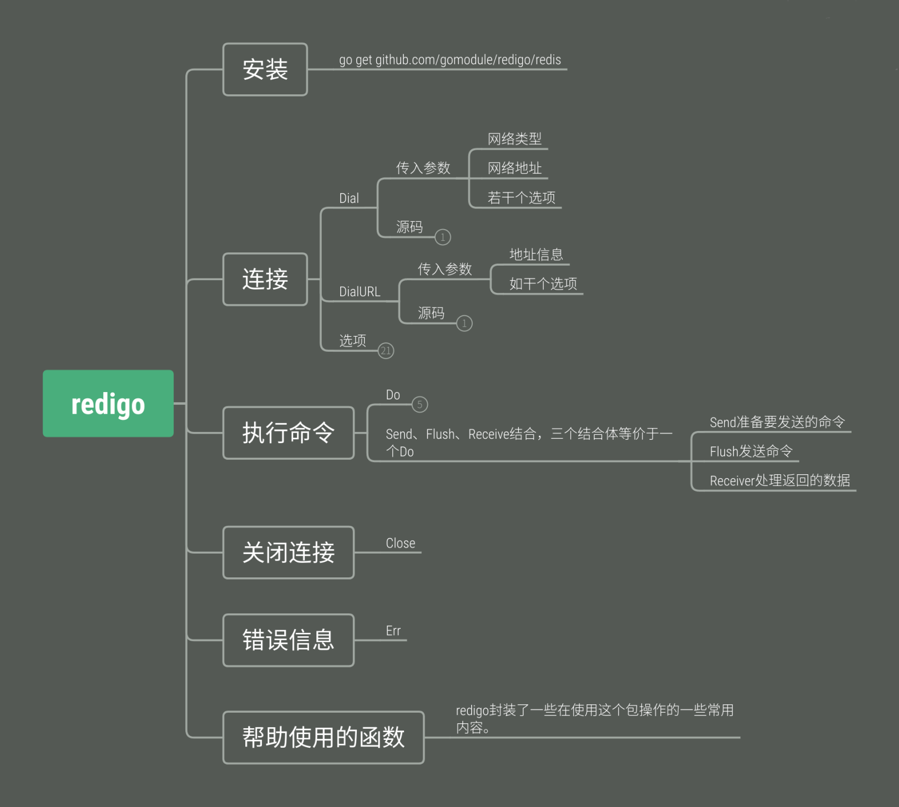

摘抄： https://cloud.tencent.com/developer/article/1517645
```
 go get github.com/gomodule/redigo/redis
```


## 测试实践
### 建立工程
在GO的源目录下建立rediogoDemo工程，包含main.go文件。

### 测试读写和有效时间

```golang
func testSetGet() {
    c, err := redis.Dial("tcp", "52.82.14.217:6379")
    if err != nil {
        fmt.Println("Connect to redis error", err)
        return
    }
    defer c.Close()

    _, err = c.Do("SET", "name", "duncanwang", "EX", "5")
    if err != nil {
        fmt.Println("redis set failed:", err)
    }

    username, err := redis.String(c.Do("GET", "name"))
    if err != nil {
        fmt.Println("redis get failed:", err)
    } else {
        fmt.Printf("Get mykey: %v \n", username)
    }

    time.Sleep(8 * time.Second)

    username, err = redis.String(c.Do("GET", "name"))
    if err != nil {
        fmt.Println("redis get failed:", err)
    } else {
        fmt.Printf("Get name: %v \n", username)
    }

}
```

### 批量写入读取

```golang
func testMSetGet() {
    c, err := redis.Dial("tcp", "52.82.14.217:6379")
    if err != nil {
        fmt.Println("Connect to redis error", err)
        return
    }
    defer c.Close()

    _, err = c.Do("MSET", "name", "duncanwang","sex","male")
    if err != nil {
        fmt.Println("redis set failed:", err)
    }

    is_key_exit, err := redis.Bool(c.Do("EXISTS", "name"))
    if err != nil {
        fmt.Println("error:", err)
    } else {
        fmt.Printf("Is name key exists ? : %v \n", is_key_exit)
    }

    reply, err := redis.Values(c.Do("MGET", "name", "sex"))
    if err != nil {
        fmt.Printf("patch get name & sex error \n。")
    } else {
        var name string
        var sex string
        _, err := redis.Scan(reply, &name, &sex);
        if err != nil {
            fmt.Printf("Scan error \n。")
        } else {
            fmt.Printf("The name is %v, sex is %v \n", name, sex)
        }
    }

}
```

### 读写json到redis转换

```golang
func testJsonConvert() {
    c, err := redis.Dial("tcp", "52.82.14.217:6379")
    if err != nil {
        fmt.Println("Connect to redis error", err)
        return
    }
    defer c.Close()

    key := "profile"
    imap := map[string]string{"name": "duncanwang", "sex": "male","mobile":"13671927788"}
    value, _ := json.Marshal(imap)

    n, err := c.Do("SETNX", key, value)
    if err != nil {
        fmt.Println(err)
    }
    if n == int64(1) {
        fmt.Println("set Json key success。")
    }

    var imapGet map[string]string

    valueGet, err := redis.Bytes(c.Do("GET", key))
    if err != nil {
        fmt.Println(err)
    }

    errShal := json.Unmarshal(valueGet, &imapGet)
    if errShal != nil {
        fmt.Println(err)
    }
    fmt.Println(imapGet["name"])
    fmt.Println(imapGet["sex"])
    fmt.Println(imapGet["mobile"])
}
```

### 主函数和引用

```golang
package main
import (
    "fmt"
    "time"
    "encoding/json"
    "github.com/gomodule/redigo/redis"
)

func main() {
    /*测试读写和有效时间*/
    testSetGet();

    /*批量写入读取*/
    testMSetGet();

    /*读写json到redis*/
    testJsonConvert();
}

// ... 加入之前的函数
```
运行结果如下，达到了预期目的。

```
 D:\jusanban\doc\50-编码实现\GO\src\rediogoDemo> go build
PS D:\jusanban\doc\50-编码实现\GO\src\rediogoDemo> ./rediogoDemo.exe
Get mykey: duncanwang
redis get failed: redigo: nil returned
Is name key exists ? : true
The name is duncanwang, sex is male
duncanwang
male
13671927788
```

REDIGO的完整帮助文档参考：

 https://godoc.org/github.com/gomodule/redigo/redis

## 框架整体介绍



## 参考
1. Go实战--golang中使用redis(redigo和go-redis/redis)

 https://blog.csdn.net/wangshubo1989/article/details/75050024

2. 开源库redigo和文档[欧阳采用]

 github地址：

 https://github.com/gomodule/redigo

 文档地址：

 https://godoc.org/github.com/gomodule/redigo/redis

 go语言使用redis（redigo）

 https://www.jianshu.com/p/62f0b9ce7584

3. 开源库go-redis/redis的使用

 github地址：

 https://github.com/go-redis/redis

 文档地址：

 https://godoc.org/github.com/go-redis/redis

4. Redis 教程

 https://www.runoob.com/redis/redis-tutorial.html

5. redis命令列表

 https://redis.io/commands